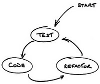

")

## Sobre o TDD

No desenvolvimento de projetos, atualmente muitos falam sobre o que é **TDD** e seus benefícios. Para quem não conhece, ele é uma metodologia de desenvolvimento de software focada na programação **orientada por teste**, em que na prática o desenvolvedor elabora um script de testes automatizados para um código de regra de negócio (funcionalidades) que será escrita no futuro (após preparar todos métodos de teste para o código).

Isso traz benefícios de garantia de que o seu código terá métodos claros e que funcionarão corretamente, pois se cria os casos de testes, depois elabora o código baseado no design do métodos que foram escritos nos testes. Isso irá forçar o programador pensar mais sobre a implementação dos comportamentos da classe de negócio. Outra vantagem é que se no futuro ocorrer uma manutenção naquela classe testada, os testes unitários informarão se a mudança no código sofrerá bugs com base nos casos de testes que falharam, fazendo com que o programador aplique as correções preventivas o quanto antes.

Existem diversos frameworks especializados em testes unitários para cada linguagem de programação, principalmente para linguagens do paradigma orientado à objetos.



O ciclo de desenvolvimento **TDD** consiste em três etapas:

1.  **Test:** elaborar o teste unitário para uma determinada classe de negócio.
2.  **Code:** codificar a classe baseando-se no design que foi implementado o teste.
3.  **Refactor:** refatorar, realizar ajustes no código até que os seus testes sejam realizados com sucesso e o código atenda corretamente os requisítos estabelecidos.

Em especial apresentarei algumas características do framework **JUnit** da plataforma **Java**, aplicando o **TDD**.

Primeiro iniciaremos implementando os testes unitários, tecnicamente os testes verificam o retorno dos métodos ou o estado de um objeto, através dos métodos **Assert**.

## O que realmente iremos testar?

Testaremos os requisítos de negócio, que neste caso será testado um simples cálculo de valor total de itens vendidos pela classe que realiza as vendas.

Ao começarmos criando os casos testes sem a existência da própria classe de negócio, teremos a liberdade de pensar em todos os testes possíveis, seja casos de sucesso e comportamentos em casos de falha. Com o passar do desenvolvimento dos scripts de teste, o design (métodos) da classe de negócio surgirá de forma mais expressiva e clara, garantindo uma boa implementação.

``` java
 // Classe de teste
 import org.junit.*;
 public class VendaTest {
   private Venda venda;
   private Integer quantidade;
   private Double valor;
   // Esta anotação define que este método será executado antes do início de cada teste.
   @Before
   public void iniciarTeste(){
      valor = 100.00;
      quantidade = 5;
   }
   // Aqui faremos um caso que teste um comportamento de sucesso do método.
   @Test
   public void deveCalcularValorTotalCorreto(){
      // Instância uma nova Venda baseado nos atributos quantidade e valor.
      venda = new Venda(quantidade, valor);
      // Definimos um valor que esperado que o método retorne.
      Double resultadoEsperado = 500.00;
      // Executamos o método da classe Venda.
      Double resultadoObtido = venda.calcularValorTotal();
      // Comparamos os valores com objetivo de testar se o valor esperado é igual ao valor do resultado obtido pelo método: venda.calcularValorTotal().
      Assert.assertEquals(resultadoEsperado, resultadoObtido);
   }
   // Aqui iremos testar um comportamento de falha do método. Na linha abaixo definimos que esse caso de teste irá lançar uma exceção como sucesso.
   @Test(expected = IllegalArgumentException.class)
   public void deveGerarUmaExcecaoAoTentarCalcularAtributosNulos(){
      // Definimos aqui os atributos com falhas.
      Double valorNulo = null;
      Integer quantidadeNula = null;
      // Instanciamos uma Venda com valores nulos.
      venda = new Venda(quantidadeNula, valorNulo);
      // É executado o método, pelo qual será lançada uma exceção como caso de sucesso.
      venda.calcularValorTotal();
   }
   // Esta anotação define que este método será executado depois do término de cada teste.
   @After
   public void finalizarTeste(){
      venda = null;
      valor = null;
      quantidade = null;
   }
 }
``` 

Com base na classe de teste, iremos implementar a classe de negócio, com objetivo de fazer o teste passar com sucesso.

``` java
 // Classe de negócio
 public class Venda {
    private Integer quantidade;
    private Double valor;
    public Venda(Integer quantidade, Double valor){
       this.quantidade = quantidade;
       this.valor = valor;
    }
    // método a testar.
    public Double calcularValorTotal(){
       if(quantidade == null || valor == null){
          throws new IllegalArgumentException();
       }
       return quantidade * valor;
    }
    public Integer getQuantidade(){
       return this.quantidade;
    }
    public Double getValor(){
       return this.valor;
    }
 }
``` 

Este foi um exemplo básico de **TDD** com **JUnit**, em que foram utilizados as principais anotações e métodos deste framework. Seguindo este conceito você estará apto a criar suas próprias classes de testes unitários, garantido assim mais qualidade e segurança no seu projeto.