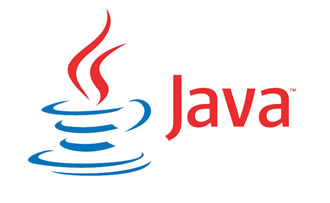
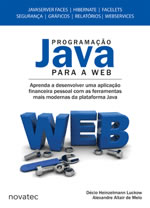
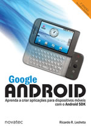
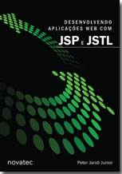
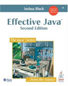

Bom a partir desse post irei começar mais uma área de recomendação de livros e ou apostilas para dar a você leitor uma estrutura completa de aprendizado sobre alguma tecnologia de mercado.
Irei apresentar algumas recomendações básicas de grande importância para te prepará-lo a programar com Java.

A plataforma Java é imensa, há mercado para trabalhar de sobra, para essa tecnologia. Entre os mais procurados, sãos os que utilizam JavaEE (Java Enterprise Edition) que é uma versão Java para web. Antigamente o JavaME (Java Mobile Edition) era um diferencial, que recentemente acabou ficando obsoleto no mercado, sendo substituído pela plataforma Android que é totalmente linguagem Java com XML.
Para essa área existem muitos frameworks em que cada empresa utiliza um ou a combinação de várias para suas soluções. Mas em essencial, nada adianta aprender tais frameworks senão existir um domínio completo sobre a linguagem.

Se você esta iniciando e quer aprender do básico ao avançado esta linguagem, siga os seguintes conselhos:

*   Domine completamente a linguagem e todas as suas técnicas de otimização de código.
*   Se estiver com condições financeiras e tempo livre, faça um exame SCJP para tirar um Certificado Java.
*   Estude bastante, pratique, compartilhe e participe de fóruns relacionado.

Abaixo seguem os links importantes sobre tudo de Java:

**Fóruns de Java:** [Grupo de Usuários Java (GUJ)](http://www.guj.com.br/ "Grupo de Usuários Java") e [JavaFree](http://javafree.uol.com.br "JavaFree")

**Apostilas gratuitas e cursos:** [Caelum](http://www.caelum.com.br/apostilas/ "Caelum")
A melhor e mais completa instituição de ensino tanto para Java quanto para outras tecnologias de mercado, é a mais reconhecida pela comunidade de desenvolvimento e possui diversos projetos open-source.

**Boas recomendações de livros:**

Livro completíssimo, pois aborda todos os principais conceitos do desenvolvimento web. Com este livro você aprenderá os seguintes frameworks de mercado: JSP, JSF, Hibernate, JDBC, Tomcat e muito mais. O livro aborda do começo ao fim essas tecnologias aplicando na prática um estudo de caso de uma aplicação financeira.

Para quem curte aplicação mobile, esse livro ensinará todas as técnicas para o desenvolvimento da plataforma que mais cresce no mercado - Android.

Livro totalmente especializado em programação dinâmica no front-end, ele ensina todos os métodos para programar com as tecnologias JSP e JSTL, tirando o máximo aproveito delas.

Direto dos autores da linguagem, este livro apresenta todos as técnicas e padrões de otimização de código com a linguagem Java, essencial para pessoas avançadas ou que desejam se tornar uma.

Muito obrigado pela atenção e espero que essas recomendações sejam de grande utilidade, em caso de dúvidas ou novas sugestões comentem abaixo.