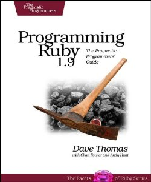
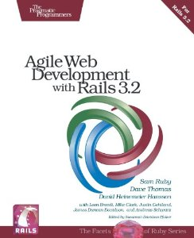
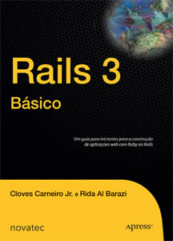

Continuando os posts de recomendações para aprendizado de uma linguagem de programação, hoje listarei alguns livros essenciais para aprendizado sobre uma tecnologia muito buscada no mercado atualmente, Ruby On Rails.

### Sites sobre linguagem Ruby:

*   [Site oficial da linguagem Ruby](http://www.ruby-lang.org/pt/)
*   [Aprenda a programar Ruby](http://aprendaaprogramar.rubyonrails.com.br/)
*   [Ruby Brasil](http://ruby-br.org/)
*   [Comunidade Ruby On Br](http://www.rubyonbr.org/)

### Sites sobre framework Rails:

*   [Documentação oficial do Rails.](http://rubyonrails.org/documentation)
*   [Apostilas da Caelum (Há uma apostila gratuita em pdf sobre Ruby On Rails.)](http://www.caelum.com.br/apostilas/)
*   [Repositório Github do Rails](https://github.com/rails/rails)
*   [Blog do Akita On Rails](http://akitaonrails.com/)

### Recomendações de livros:

Livro completo que aborda exclusivamente sobre a linguagem Ruby abordando os novos recursos da sua versão 1.9.

Os autores deste livro são os criadores do framework Rails, há muita informação de qualidade neste livro, abordando não só as funcionalidades, como também as boas práticas de agilidade a serem aplicadas em projetos com Rails versão 3.2.

Este livro destina-se a qualquer pessoa interessada em aprender como desenvolver aplicações web utilizando o framework Ruby on Rails. Iniciando com uma introdução completa ao panorama do Rails 3\. Neste livro, você encontrará conselhos e soluções práticas para problemas comuns. Mostraremos aquelas que, para nós, são as melhores técnicas e ferramentas que você pode utilizar quando trabalha com o Rails.

É isso ai!! se gostou comenta ok? Obrigado pela atenção e também de uma olhada no post [Quer aprender Java?](../quer-aprender-java/ "Quer aprender Java?"). See you later!