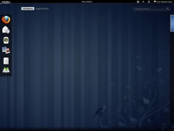
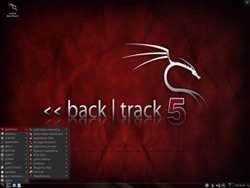
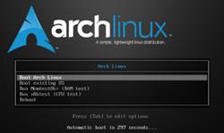

# Linux adequado para sua necessidade - Parte 3

Continuando o post em nosso terceiro capítulo da saga: **Linux Adequado a sua necessidade**. Hoje apresentarei três distros bem conhecidas mas que vale a pena salientar suas funcionalidades e seu objetivo no mundo open-source do Linux. Os subtópicos abordados nesse post serão sobre distribuições para: **servidores, auditoria e sistema minimalista.**

#### Servidores

**Fedora:** É uma distro muito famosa no mundo Linux, seja para uso doméstico quanto para servidores. Ela é baseada e patrocinada pela comunidade do sistema [Red Hat](http://www.redhat.com/ "Site oficial do Red Hat"), considerada uma das melhores soluções Linux para servidores coorporativos. Muitos utilizam o Fedora como servidores, pois ela apresenta como diferencial: **velocidade acima da média, estabilidade e grande compatibilidade com a maioria dos computadores.** Atualmente o Fedora também recebeu grande consideração pelos usuários desktop e por causa desse motivo, segundo dados do site [distrowatch.com](http://distrowatch.com "DistroWatch") ela é considerada a terceira distribuição linux mais usada no mundo. Sua nova **versão 16** se encontra em fase beta e sua **versão estável atual é a 15**. O Fedora utiliza ambiente gráfico padrão **GNOME 3**, gerenciador de pacotes **YUM** e Bootloader **Grub 2**, possui uma vasta lista de aplicativos que são compatíveis também com o **Ubuntu** e a maioria das outras distribuições, além de possuir seus próprios repositórios voltados para área de **segurança e redes.**

Site oficial: [http://fedoraproject.org/](http://fedoraproject.org/ "Site oficial do Fedora")

#### Ferramenta de auditoria

**BackTrack:** É considerada como uma ótima solução para auditoria, penetração em sistemas e recuperação de dados. O BackTrack possui as principais ferramentas open-sources para realizar auditoria e testes de segurança. O sistema é baseado no **Ubuntu** e possui ambiente gráfico **FluxBox**. [A Wiki oficial do BackTrack](http://www.backtrack-linux.org/wiki/index.php/Main_Page "Wiki BackTrack ") apresenta uma documentação completa, explicando passo-a-passo desde a instalação do sistema até a configuração de suas aplicações nativas, além de ensinar como realizar algumas técnicas de hacks e auditorias com suas ferramentas nativas que realizam: **testes de stress, exploitation, engenharia reversa, investigação digital, exploração de vulnerabilidades, recuperação de dados e muito mais.**

Site oficial: [http://www.backtrack-linux.org](http://www.backtrack-linux.org/ "Site oficial do BackTrack")

#### Sistema minimalista

**Arch Linux:** Atualmente é a minha distro favorita, ela utiliza o conceito conhecido como **KISS (Keep It Simple, Stupid!)**, ou seja, é um sistema operacional que vem apenas com o mínimo de recursos necessário para sua instalação, resumindo-se em um **kernel**, um gerenciador de pacotes chamado de **pacman** e um **terminal**. Recomendado para quem deseja se aprofundar no mundo linux, pois toda ação no sistema é realizada através do **terminal console**. Por ser um sistema minimalista ele não vem acompanhado com um ambiente gráfico padrão e muito menos drivers específicos a um hardware. Possui uma documentação completa através do [Arch Wiki](https://wiki.archlinux.org/index.php/Main_Page "Arch Wiki") e uma comunidade ativa que cresce constantemente colaborando para o sistema. Outro diferencial do Arch é que seu ritmo de desenvolvimento é através de **Rolling Releases** de um ano. Atualmente sua versão é **2011.08.19**.

Site oficial: [http://www.archlinux.org](http://www.archlinux.org/ "Site oficial do Arch Linux")

Por enquanto é isso pessoal! Espero que gostem desse post, em breve continuarei com mais um capítulo dessa saga. Se tiver alguma recomendação de sistema Linux específico para uma necessidade, ficarei grato em receber e pesquisar a respeito! Basta comentar abaixo que quando estiver com tempo livre irei pesquisá-lo. Se você ainda não viu, recomendo ler os posts:

*   [Linux adequado para sua necessidade - Parte 1](../linux-adequado-para-sua-necessidade-parte-1 "Linux adequado para sua necessidade – Parte 1")
*   [Linux adequado para sua necessidade - Parte 2](../linux-adequado-para-sua-necessidade-parte-2 "Linux adequado para sua necessidade – Parte 2")