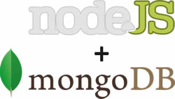

# Node.js e MongoDB na prática!



Recentemente fiz uma mini-aplicação no meu trabalho, e resolvi aplicar na prática meus conhecimentos sobre **Node.js**. Com isso apenas precisava escolher um banco de dados que fosse tão simples e fácil quanto a própria linguagem da aplicação. Na verdade eu estava em busca de aprender um pouco sobre bancos **NoSQL** e a recomendação que me veio foi sobre o **MongoDB**.

Na wiki oficial sobre módulos do Node.js [https://github.com/joyent/node/wiki/modules](https://github.com/joyent/node/wiki/modules "Node.js wiki módulos") existem cerca de 1100 módulos para Node.js e existem 15 módulos para **MongoDB** com **Node.js**.

Desses 15 módulos apenas testei 4 pelo qual 3 deles fiquei meio perdido por falta de uma clara documentação e o módulo que tive mais afinidade e facilidade em usar foi o [mongoq](https://github.com/zzdhidden/mongoq "Github do Mongoq"), inclusive até conheci o autor desse módulo, um chinês muito gente boa que me ajudou, ensinando as boas práticas do seu módulo.

Abaixo irei explicar um pouco de código para criar um mini-aplicativo de cadastro de usuários. Lembrando que utilizarei também o [Express](http://expressjs.com/ "Express") que permitie criar as rotas da aplicação, pois o código abaixo apenas apresentarei como fazer um simples **controller** criando as rotas e explorando as funcionalidades do **MongoQ**, mas não entrarei em detalhes sobre o **Express**, pois não é o objetivo desse post.

Primeiro, para começarmos a brincadeira, instale os seguintes módulos:

``` bash
 npm install express mongoq
``` 

Agora crie o arquivo **app.js** e mãos a obra!

``` javascript
 // Instanciando os módulos Express e Mongoq
 var express = require('express');
 var mongoq = require('mongoq');
 // Configurando a execução do banco MongoDB
 var COLLECTION = 'collection_teste';
 var DB = 'banco_teste';
 var db = mongoq(DB);
 var collection = db.collection(COLLECTION);
 // Iniciando o servidor Express
 var app = module.exports = express.createServer();
 // Configuração básica do servidor Express
 app.configure(function(){
    app.use(express.bodyParser());
    app.use(express.methodOverride());
    app.use(app.router);
 });
 // Rota GET para listar os usuários
 app.get('/usuarios', function(req, res){
    // Fazendo uma consulta no banco de dados
    collection.find().toArray(function(err, result){
       res.render('index', { usuarios : result });
    });
 });
 // Rota GET para consultar um usuário
 app.get('/usuario/:id', function(req, res){
    // Recebendo os parâmetros de um query string
    var id = req.params.id;
    // Fazendo uma consulta no banco de dados
    var params = {usuario : {id: id}};
    collection.find(params).toArray(function(err, result){
       res.render('ver', { usuario : result.usuario });
    });
 });
 // Rota POST para cadastrar um usuário
 app.post('/usuario', function(req, res){
    // Recebendo os parâmetros da requisição
    var usuario = req.body.usuario;
    // Persistindo o novo usuário
    collection.insert({usuario : usuario});
    res.redirect('/usuarios');
 });
 // Rota PUT para atualizar um usuário
 app.put('/usuario/:id', function(req, res){
    // Recebendo os parâmetros de um query string
    var id = req.params.id;
    // Recebendo os parâmetros da requisição
    var usuario = req.body.usuario;
    // Atualizando dados do usuário que possuir este id
    collection.update({usuario: {id: id }}, {usuario : usuario});
        res.redirect('/usuarios');
    });
 // Rota DELETE para excluir um usuário
 app.del('/usuario/:id', function(req, res){
    // Recebendo os parâmetros de um query string
    var id = req.params.id;
    // Excluindo o usuário do banco de dados
    collection.remove({usuario : {id: id }});
    res.redirect('/usuarios');
 });
``` 

Na prática este simples código já exemplifica o poder que **Node.js + MongoDB + Express** pode fazer.

Para conhecer em mais detalhes essas tecnologias visite:

*   **Site Oficial do MongoDB:** [http://www.mongodb.org/](http://www.mongodb.org/ "Site Oficial do MongoDB")
*   **Site Oficial do Node.js:** [http://nodejs.org/](http://nodejs.org/ "Site oficial do Node.js")
*   **Site Oficial do Express:** [http://expressjs.com/](http://expressjs.com/ "Site Oficial do Web Framework Express")
*   **Github do MongoQ:** [https://github.com/zzdhidden/mongoq](https://github.com/zzdhidden/mongoq "Github do MongoQ")

Por enquanto é isso pessoal, espero que tenham gostado dessa e em breve publicarei novas descobertas dessa incrível tecnologia que ando estudando ultimamente.