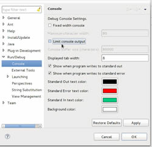
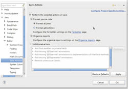
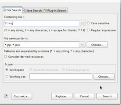
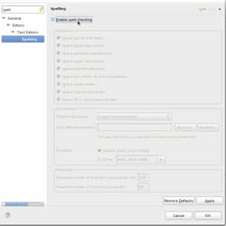

Para os que utilizam o **Eclipse IDE**, segue abaixo algumas simples dicas, que na verdade são algumas pequenas configurações que realmente fazem diferença e aumentam a produtividade ao utilizar essa incrível ferramenta.

## Removendo o limite de impressões no console

 

Acesse o menu **Window >> Preferences** e em seguida, na aba esquerda escolha a opção **Run/Debug >> Console**, agora desabilite a opção **Limit console output**.

## Auto-import de pacotes e auto-identação ao salvar

 

Acesse o menu **Window >> Preferences** e entre em **Java >> Editor >> Save Action**. Agora habilite as opções:

*   Perform the selected actions on save
*   Format source code
*   Organize imports

## Buscando ocorrências de um código em qualquer arquivo

 

Acesse o menu **Search >> File...** e no **Containing Text...** digite um trecho de codigo que deseja pesquisar e no campo abaixo **File name patterns...** informe o tipo de extensão de arquivo que deseja buscar.

Um bom exemplo de patterns: ***.jsp, *.java, *.html**.

Para pesquisar clique em **Search**.

## Desabilitando Spell Checkings

 

Para desabilitá-lo acesse no menu **Window >> Preferences** a opção **General >> Editors >> Text Editors >> Spelling** e desative a opção principal: **Enable Spell Checking**.

Pronto, com isso você terá otimizado alguns pequenos detalhes que irão aumentar a sua **produtividade** ao utilizá-lo em seu dia-a-dia de **garoto de programa**.