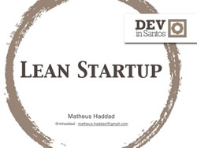
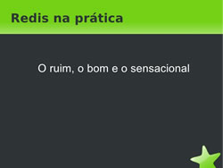
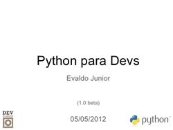

# Slides do 3˚ DevInSantos

Olá pessoal!! Hoje como prometido irei postar os slides de todas as apresentações que rolou no [3˚ Encontro do Grupo de Desenvolvedores de Santos - DevInSantos](http://www.meetup.com/devinsantos/events/58256142/ "DevInSantos").

Lembrando que recomendo a todos os interessados se cadastrarem no [Meetup do DevInSantos](http://www.meetup.com/devinsantos/ "DevInSantos") para ficar por dentro dos próximos eventos.

Foram 6 incríveis palestras, pelo qual o evento foi o dia todo, das 9 da manhã até 18 da tarde, abaixo segue os sldies de cada palestrante:

[")](http://www.slideshare.net/RicardoValeriano/a-primeira-app-ios-a-gente-no-esquece "A primeira app iOS (a gente não esquece)")

É isso ae pessoal até o próximo [DevInSantos](http://www.meetup.com/devinsantos/ "DevInSantos")!