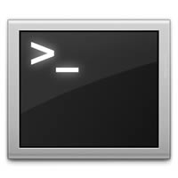

A dica de hoje será bem útil, com ela você estará apto para manipular diversos arquivos de um determinado diretório. Por exemplo, será possível processar em paralelo arquivos em lote e qualquer comando que você trabalhe com arquivos será possível aplicar esse conceito que explicarei abaixo.

O comando que utilizaremos é: `ls | xargs -I '{}'`. Basicamente esse comando é a junção do `ls` (responsável por listar todos os arquivos de um diretório) com `| xargs -I '{}'` (comando que recebe o resultado do comando anterior e mantém cada resultado dentro `-I '{}'` preparado para ser alterado pelo próximo comando que você escrever no final desse comando.)
Veja um exemplo mais prático:

``` bash
 ls /documents | xargs -I '{}' mv /backups/'{}.old'
``` 

Essa combinação de comandos simplesmente listou todos os arquivos da pasta `/documents` e moveu cada arquivo para a pasta `/backups` renomeando os arquivos com a extensão `.old`.

Com o comando `xargs` é possível automatizar muitas tarefas em seu console, pois ele permite `execução paralela das tarefas`.

Esse foi apenas um pequeno exemplo desse poderoso comando, para melhores detalhes recomendo estudar alguns links:

*   [Wiki about Xargs](http://en.wikipedia.org/wiki/Xargs "Wiki about Xargs")
*   [Xargs - Linux command](http://linux.about.com/library/cmd/blcmdl1_xargs.htm "Xargs - Linux Command")
*   [10 Xargs command example in linux](http://javarevisited.blogspot.com.br/2012/06/10-xargs-command-example-in-linux-unix.html "10 Xargs command example in linux")