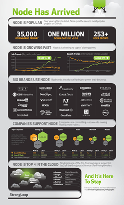

# Infográfico The State of Node

The State of Node é um infográfico publicado pela [StrongLoop](http://strongloop.com "StrongLoop") que apresenta o quão popular esta o Node.js neste ano, em relação a novos projetos open-source, novos release e quem das grandes empresas utiliza esta tecnologia.

Fonte: [The State of Node](http://strongloop.com/community/nodejs-infographic "The State of Node")