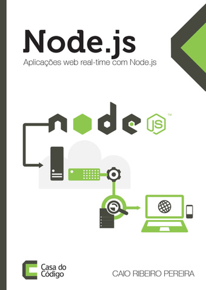

# Lançamento oficial do livro de Node.js

Fala pessoal, é com muito orgulho que venho divulgar aqui meu primeiro livro sobre Node.js que foi oficialmente lançado hoje.

No livro estou explorando os principais recursos da plataforma Node.js, explicando as vantagens do desenvolvimento orientado à eventos, I/O não-bloqueante e programação assíncrona, além de apresentar durante o decorrer dos capítulos o desenvolvimento de uma mini-agenda de contatos integrada com um chat real-time utilizando seus principais frameworks: Express, Socket.IO, Mongoose, Node Redis, Mocha, Clusters e integração com o servidor Nginx.

Esta muito bacana o livro e os requisítos mínimos são: conhecer o básico da **linguagem Javascript e noções de arquitetura cliente-servidor**.

Se você gostou do livro, [clique aqui ou na imagem do livro para comprá-lo](https://casadocodigo.refersion.com/l/630.1389 "Livro: Aplicações web real-time com Node.js"), ele esta a venda nas versões ebook e impresso.