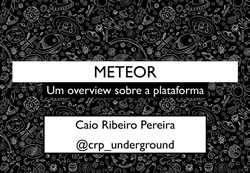

# Meteor - Um overview sobre a plataforma

Para quem não participou do evento [DevInSantos](http://www.devinsantos.com.br/), veja os slides da minha palestra pelo qual falei sobre um assunto que na sala ninguém ainda conhecia, [Meteor](http://meteor.com).

Com o surgimento do [Meteor](http://meteor.com), desenvolver aplicações real-time ficou mais fácil! Neste palestra apresento uma breve história, seus princípios, boas práticas deste framework que mesmo ainda em sua versão preview, já demonstrou o quão produtivo e simples é de se trabalhar com ele.