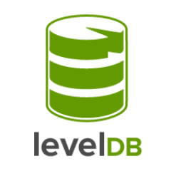

O LevelDB é um banco de dados que possui uma forte ligação com Node.js. Ele basicamente é um banco semelhante ao [SQLite](http://www.sqlite.org/), um embedded database, porém em NoSQL do tipo key-value.

Este é um projeto open source criado pelo Google, afinal de início, o objetivo inicial era de criar um db nativo para o Chrome, em que levasse algumas características de [BigTable](http://pt.wikipedia.org/wiki/BigTable), e assim surgiu o [IndexedDB](http://www.html5rocks.com/pt/tutorials/indexeddb/todo).

O LevelDB ficou tão popular que algumas empresas fizeram forks dele. E assim surgiu o [Riak](http://basho.com/riak/) um DB escrito em Erlang pela empresa Basho, surgiu o [HyperDB](http://wordpress.org/plugins/hyperdb) da empresa Hyperdex e o [RocksDB](http://rocksdb.org/) que é mantido pela equipe do Facebook.

Para a comunidade Node.js, existe o [LevelDown](https://github.com/rvagg/node-leveldown) (versão baixo nível em linguagem C compilado para rodar no Node.js) e o [LevelUP](https://github.com/rvagg/node-levelup) (API Node que executa as funcionalidades do LevelDown). Esses dois módulos você os encontram ao instalar o módulo level (via `npm install level`), sem a necessidade de instalar algo adicional em seu projeto Node.js.

A comunidade Node também faz sua parte criando plugins, alguns em destaque são:

*   [Level-Sublevel](https://github.com/dominictarr/level-sublevel) - cria registros JSON parecido com as collections do MongoDB;
*   [Level-Inverted-Index](https://github.com/dominictarr/level-inverted-index) - realiza Full-Text Search nos registros;
*   [JSONQuery-Engine](https://github.com/eugeneware/jsonquery-engine) - plugin para criar queries estilo MongoDB;
*   [Level-Scheduler](https://github.com/juliangruber/level-schedule) - Schedule Jobs via LevelDB;
*   [Level-Multiply](https://github.com/rvagg/node-level-multiply) - plugin para realizar queries com múltiplos dados;

Neste link tem muito mais: [https://github.com/rvagg/node-levelup/wiki/Modules](https://github.com/rvagg/node-levelup/wiki/Modules).

Para finalizar este post, mostrarei um pouco de código, criaremos um CRUD de cadastro de usuários, que será uma API em [Express](https://github.com/visionmedia/express) com [LevelUP](https://github.com/rvagg/node-levelup).

Crie o arquivo app.js incluindo o código abaixo:

``` javascript
 var
   express = require('express'),
   uuid = require('node-uuid'),
   level = require('level'),
   db = level('./users.db'),
   app = express()
 ;
 app.set('port', process.env.PORT || 3000);
 app.use(express.logger());
 app.use(express.json());
 app.use(app.router);
 app.get('/', function(req, res) {
   var users = [];
   var stream = db.createReadStream();
   stream.on('data', function (data) {
     users.push(data);
   });
   stream.on('error', function (err) {
     return res.json(500, err);
   })
   stream.on('end', function () {
     return res.json(200, users);
   });
 });
 app.get('/user/:id', function(req, res) {
   db.get(req.params.id, function(err, user) {
     if (err) return res.json(500, err);
     return res.json(200,user);
   });
 });
 app.post('/user', function(req, res) {
   db.put(uuid.v1(), req.body.user, function(err) {
     if (err) return res.json(500, err);
     return res.json(200);
   });
 });
 app.del('/user/:code', function(req, res) {
   db.del(req.params.code, function(err) {
     if (err) return res.json(500, err);
     return res.json(200);
   });
 });
 app.listen(app.get('port'), function() {
   console.log("API LevelDB na porta %d", app.get('port'));
 });
``` 

Agora para criar a aplicação, execute:

``` bash
 npm init
``` 

Responda as perguntas desse comando para no final gerar o `package.json` corretamente.

Em seguida instale as dependências via comando:

``` bash
 npm install express node-uuid level --save
``` 

Para ver sua API funcionando rode:

``` bash
 node app
``` 

Se quiser testar sua API, utilize qualquer REST Client, como por exemplo o [POSTMAN no Google Chrome](https://chrome.google.com/webstore/detail/postman-rest-client/fdmmgilgnpjigdojojpjoooidkmcomcm).

Com esse rascunho de API, você já estará preparado para criar um front-end dessa aplicação. E caso queira aprofundar seus estudos em LevelDB junto com Node.js, acesse seu github: [https://github.com/rvagg/node-levelup](https://github.com/rvagg/node-levelup)