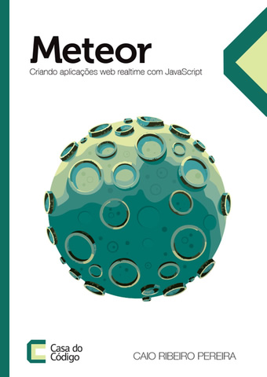

Olá! Quero apresentar a vocês mais um novo livro que foi lançado sua versão final mês passado. Estou falando do livro que escrevi sobre o framework Meteor, que cada vez mais ganha espaço no mundo de aplicações web.

Neste livro que escrevi em parceria com a editora [Casa do Código](http://casadocodigo.com.br), foquei em uma escrita mais prática, para leitores iniciantes e avançados já botarem a mão na massa desde os primeiros capítulos.

Com isso, nasceu um livro 100% hands-on que desde o ínicio apresenta os principais recursos e conceitos do Meteor, além utilizar alguns packages adicionais. Tudo isso, explorando o desenvolvimento de um projeto piloto, que é uma rede social (mini-clone do Twitter) chamado [MeteorBird](https://github.com/caio-ribeiro-pereira/meteor-bird).

Neste projeto piloto, você vai implementar login convencional e **signup com uma conta do Facebook utilizando a API nativa Accounts**. Você trabalhar muito com os principais conceitos do **template UI Blaze** e seu **template engine Handlebars**. Também é apresentado **boas práticas de segurança e programação reativa**, além de explorar os principais conceitos sobre **real-time utilizando PubSub nativo do Meteor**, criação de **testes com Laika** e **Collections do MongoDB**.

Os últimos capítulos é dedicado exclusivamente para performance e deploy, em que para isso é utilizado alguns packages third-party conhecidos, como o **Find-Faster, Fast-Render, NPM, AppCache, Demeteorizer** e muito mais.

O livro esta muito legal e é recomendável para quem deseja aprender mais sobre esse incrível framework. Para comprá-lo, basta visitar este link: [Meteor - Criando aplicações web real-time com JavaScript](https://casadocodigo.refersion.com/l/d88.3525 "Meteor - Criando aplicações web real-time com JavaScript").
See ya!